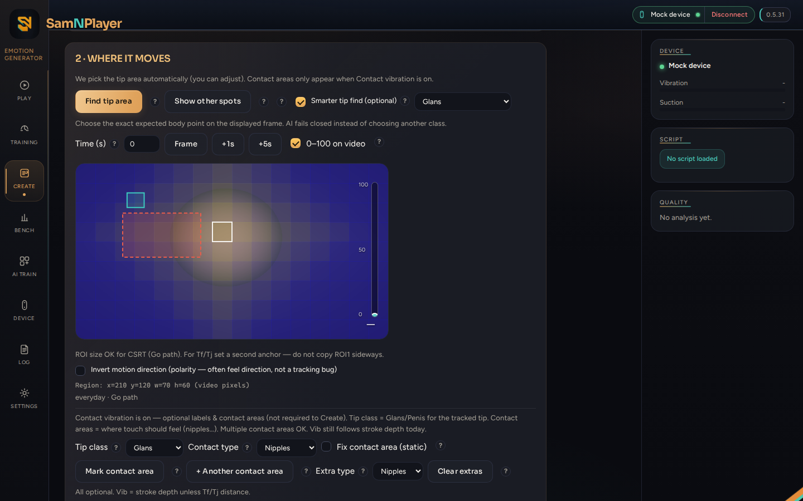
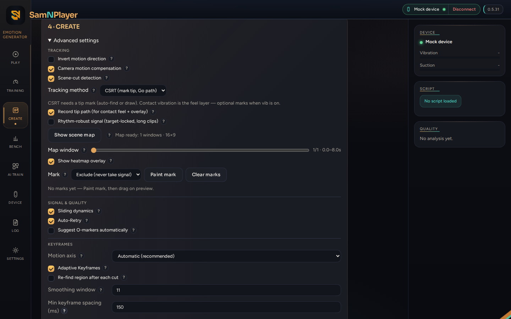
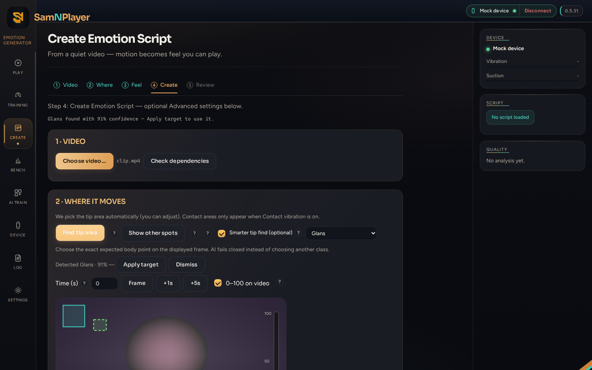
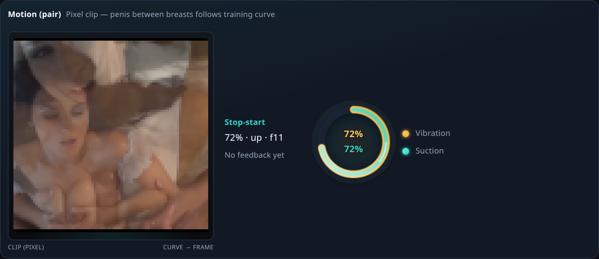

<p align="center">
  
</p>

<h1 align="center">SamNPlayer</h1>

<p align="center">
  <strong>Generate · Play · Train</strong> — local desktop app for
  <code>.samn</code> / <code>.funscript</code> and SVAKOM Sam Neo&nbsp;2 / Neo&nbsp;2&nbsp;Pro
</p>

<p align="center">
  <a href="https://github.com/funfunpayer/SamNPlayer/releases/tag/v0.5.31"></a>
  <a href="https://github.com/funfunpayer/SamNPlayer-site/releases/latest"></a>
  <a href="https://github.com/funfunpayer/SamNPlayer/actions/workflows/tests.yml"></a>
  
  
  
</p>

<p align="center">
  <a href="https://github.com/funfunpayer/SamNPlayer-site/releases/latest"><strong>Download</strong></a>
  ·
  <a href="#whats-new-in-v0531">What’s new</a>
  ·
  <a href="#why-samnplayer">Why this app</a>
  ·
  <a href="#screenshots">Screenshots</a>
  ·
  <a href="#build-from-source">Build</a>
  ·
  <a href="docs/PLATFORMS.md">Platforms</a>
  ·
  <a href="CHANGELOG.md">Changelog</a>
</p>

<p align="center">
  
</p>

---

## What’s new in v0.5.31

Shipped **24 Sep 2026** — [release notes](https://github.com/funfunpayer/SamNPlayer/releases/tag/v0.5.31) · [CHANGELOG](CHANGELOG.md)

| Theme | What landed |
|-------|-------------|
| **Scene map** | Advanced *Show scene map* — rhythm heatmap, window slider, exclude / source / region marks (#246 / #247) |
| **Target lock** | Strict expected body-point proposal + rhythm-grid seed lock — stronger neighbours cannot steal the stroke (#248) |
| **Local learning** | Go `profilemodel` — train from Create labels; suggestions stay suggest-only (#244) |
| **Stage B** | Stroke-preview steers cut-rate → re-find + pan → camera compensation (#239) |

<p align="center">
  
  <br />
  <em>Scene map</em> — heatmap overlay + painted exclude mark (current map window)
</p>

<p align="center">
  
  <br />
  <em>Advanced</em> — map window, overlay toggle, paint mark / clear
</p>

<p align="center">
  
  <br />
  <em>Semantic target</em> — expected body point + Apply (AI proposes, never auto-writes)
</p>

**Still Owner before next defaults:** speed-cap product rule; ≥4–5 rhythm-grid clips. Next build theme: SceneMap **P3** (engine consumes marks).

---

## Why SamNPlayer

Most tools in this space are either a **player**, a **generator**, or a
**heavy Electron shell**. SamNPlayer is one native desktop app that does
the full loop — and stays honest about what is measured vs. what is only
suggested.

| | Typical alternatives | **SamNPlayer** |
|---|---|---|
| App size | Electron often 100+ MB | **~13 MB** GUI (OS webview via [Wails](https://wails.io) — no bundled Chromium) |
| Scope | Play *or* generate | **Play + generate + device + training** in one window |
| AI | Cloud, bundled weights, or AI-only scripts | **Optional local ONNX + Go profilemodel** — AI *proposes*, classical tracking *writes* the Funscript |
| Privacy | Telemetry / downloads common | **Local-only** — no model in the binary, no surprise downloads, no cloud calls |
| Video tools | “Install ffmpeg yourself” | **Portable zip** ships ffmpeg next to the app; optional Settings install (`docs/FFMPEG_TOOLS.md`) |
| Device | Generic Buttplug clients | **Sam Neo 2 first-class** (BLE + Intiface + Mock) with diagnostics |
| Quality | “Looks fine” | **Quality Doctor**, Script Doctor, golden-clip benchmark — numbers before claims |
| Engineering | Feature pile-on | **Measure → ship or reject** (`HANDOFF.md`, `docs/ENGINEERING_STANCE.md`) |

**What we deliberately do *not* do:** FunGen clones, silent AI Funscripts,
frameless glassmorphism fashion, or cloud sync. If it is not measured or
not needed, it stays out.

---

## Screenshots

<p align="center">
  
  <br />
  <em>Generate</em> — mark tip / contact, pick profile, Quality Doctor on the rail
</p>

<p align="center">
  
  <br />
  <em>Playback</em> — script-alone or video-synced; heatmap, contact vibration, playlist
</p>

<p align="center">
  
  <br />
  Live device meters, soft, Extended-O — curve and device keep running even without a film
</p>

<p align="center">
  
  <br />
  <em>Training</em> — multi-phase scripts, live dual ring, session history
</p>

---

## What you get

### Playback
- Real `<video>` in-app (no separate VLC window); optional **video-position sync** to the device
- Heatmap, curve editor, chapters, O-markers, Script Doctor
- Hover **tooltips** (time + value) on curve and heatmap
- Playlist with **shuffle** and **repeat**
- Script-alone mode when there is no video yet
- “Make playable” H.264 proxy when the webview cannot decode the source

### Generator
- Classical CV first (CSRT / flow) — works without any AI install
- **Everyday:** tip-CSRT + Contact vib; Advanced opt-in *Rhythm-robust signal* (target-locked)
- **Scene map** (Advanced): quick rhythm heatmap + exclude / source / region marks
- Optional **local AI ROI** (ONNX) — strict expected body point, Apply required
- Local **Go profilemodel** suggestions from Create labels (suggest-only)
- Quality Doctor + human accept/reject → optional learned quality model
- Golden-clip benchmark tab for repeatable FunGen comparisons

### Device & training
- BLE, Intiface/Buttplug, and Mock transports
- Device diagnostics (acceptance sweeps, update-rate probes)
- Training tab: stop-start / plateau, multi-phase scripts, live dual ring + clip motion, session history

### Desktop craft
- Emotion look (Sora / Figtree), English product language
- Window min-size, ARIA tabs, ERROR toast → Log
- Auto-update from GitHub Releases with checksum verification

---

## Download

Ready-to-run **Windows** and **Linux** binaries (GUI + CLI) are published on the
**public** showcase ([SamNPlayer-site releases](https://github.com/funfunpayer/SamNPlayer-site/releases))
with `checksums.txt`. Private-repo releases are not anonymously downloadable —
after each tag run `./scripts/publish-public-release.sh vX.Y.Z` (and
`./scripts/sync-public-site.sh` when screenshots/landing change).

Prefer the **portable** archives (`SamNPlayer-portable-*-amd64`) — they
include `ffmpeg` / `ffprobe` next to the GUI so you do not need a system
install. Single-file GUI binaries remain for in-app updates. Details:
[`docs/FFMPEG_TOOLS.md`](docs/FFMPEG_TOOLS.md).

| Platform | Now | Later |
|----------|-----|-------|
| Windows / Linux | GUI + CLI + portable ffmpeg | — |
| macOS | Code-ready; **no release binary yet** (needs Mac builder) | Signed `.app` |
| iPhone / Android | — | **Player only** (no Generate) |

Platform fence: [`docs/PLATFORMS.md`](docs/PLATFORMS.md) · Competitive bar:
[`docs/COMPETITIVE.md`](docs/COMPETITIVE.md) · Lean self-build:
[`docs/SELF_BUILD.md`](docs/SELF_BUILD.md).

Latest private tag: **[v0.5.31](https://github.com/funfunpayer/SamNPlayer/releases/tag/v0.5.31)**  
Public downloads: **[SamNPlayer-site](https://github.com/funfunpayer/SamNPlayer-site/releases/latest)**  
Source version file: [`VERSION`](VERSION) (`update.BaseVersion`).

**Bluetooth on Windows 11:** Intiface recommends an external dongle with an
antenna (e.g. TP-Link UB500 / Asus USB-BT500), not bare onboard radios.
[Hardware guidance](https://intiface.com/docs/intiface-central/hardware/bluetooth/).

---

## Build from source

> Team only — application source is **private**. Public visitors use [SamNPlayer-site](https://github.com/funfunpayer/SamNPlayer-site).

Needs Go, and Node/npm for the GUI frontend.

```bash
go build ./cmd/cli                                 # CLI
cd cmd/gui-wails && wails build -tags webkit2_41   # GUI (Linux / WebKitGTK 4.1)
```

Cross-compile Windows GUI from Linux:

```bash
cd cmd/gui-wails
GOOS=windows GOARCH=amd64 wails build -platform windows/amd64 \
  -ldflags "-X github.com/funfunpayer/SamNPlayer/update.Version=v0.5.31"
```

Generator extras need **Python 3.9+** and
`pip install -r generator/requirements.txt`. Optional AI:
`generator/requirements-ai.txt` / train deps via the KI-Training tab.

---

## How AI fits (and where it stops)

```text
  Video ──► [optional ONNX ROI / Go profilemodel suggestion]
                 │  (Apply required — never silent)
                 ▼
           Classical tracker (CSRT + optional rhythm-grid lock)
                 │
                 ▼
           Funscript + Quality Doctor
```

There is **no** second, AI-only path that writes `.samn` / `.funscript` files by
itself. Details: [`docs/AI_ADAPTER.md`](docs/AI_ADAPTER.md),
[`docs/KI_TRAINING.md`](docs/KI_TRAINING.md),
[`docs/ENGINEERING_STANCE.md`](docs/ENGINEERING_STANCE.md),
[`docs/SCENE_MAP_PLAN.md`](docs/SCENE_MAP_PLAN.md).

---

## Docs map

| Doc | What it is |
|---|---|
| [`docs/ENGINEERING_STANCE.md`](docs/ENGINEERING_STANCE.md) | Shared Bau/Planung locks — stack, AI, scene map, rhythm |
| [`docs/SCENE_MAP_PLAN.md`](docs/SCENE_MAP_PLAN.md) | Scene map plan (P1–P5) — heatmap, marks, learning data |
| [`docs/EVERYDAY_GENERATE.md`](docs/EVERYDAY_GENERATE.md) | Everyday Create path (tip-CSRT + Contact) |
| [`docs/PRODUCTION_ROADMAP.md`](docs/PRODUCTION_ROADMAP.md) | Production spine G0–G4 + release train |
| [`docs/GENERATE_HEURISTICS.md`](docs/GENERATE_HEURISTICS.md) | Classical Generate heuristics (knob → code → default) |
| [`docs/AI_ADAPTER.md`](docs/AI_ADAPTER.md) | AI suggest-only contract |
| [`docs/KI_TRAINING.md`](docs/KI_TRAINING.md) | Local training / profilemodel |
| [`docs/AGENT_COORD.md`](docs/AGENT_COORD.md) | Who owns what (agents) |
| [`docs/AUDIO_WORKFLOW.md`](docs/AUDIO_WORKFLOW.md) | Audio tempo check in generate |
| [`docs/LICENSE_SYSTEM.md`](docs/LICENSE_SYSTEM.md) | Yearly personal license — **€40 / year** |
| [`website/`](website/) | Public landing + guides (sync → SamNPlayer-site) |
| [`CHANGELOG.md`](CHANGELOG.md) | Release notes |
| [`HANDOFF.md`](HANDOFF.md) | Architecture + tested-and-rejected table |

---

## Contributing

See [CONTRIBUTING.md](CONTRIBUTING.md). One manageable task, regression
tests for behavior changes, measurements instead of vibes. Day-to-day
discussion may be German; **shipped UI and docs are English**.

License: proprietary — see [LICENSE](LICENSE). Public face + downloads: [SamNPlayer-site](https://github.com/funfunpayer/SamNPlayer-site).
