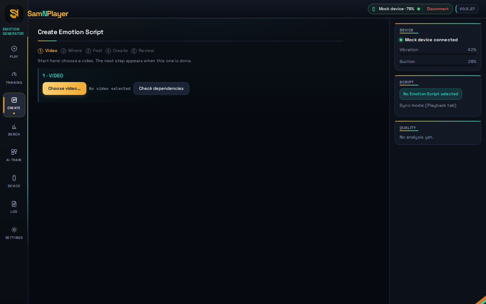
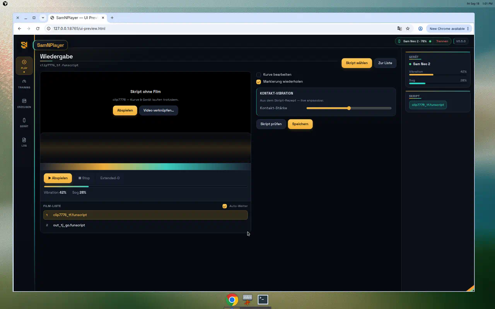
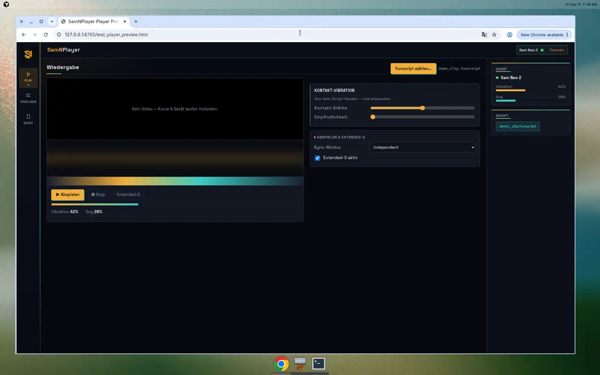

<p align="center">
  
</p>

<h1 align="center">SamNPlayer</h1>

<p align="center">
  <strong>Generate · Play · Train</strong> — local desktop app for
  <code>.samn</code> / <code>.funscript</code> and SVAKOM Sam Neo&nbsp;2 / Neo&nbsp;2&nbsp;Pro
</p>

<p align="center">
  <a href="https://github.com/funfunpayer/SamNPlayer/releases/latest"></a>
  <a href="https://github.com/funfunpayer/SamNPlayer/actions/workflows/tests.yml"></a>
  <a href="LICENSE"></a>
  
  
</p>

<p align="center">
  <a href="https://github.com/funfunpayer/SamNPlayer/releases/latest"><strong>Download</strong></a>
  ·
  <a href="#why-samnplayer">Why this app</a>
  ·
  <a href="#screenshots">Screenshots</a>
  ·
  <a href="#build-from-source">Build</a>
  ·
  <a href="docs/LANGUAGE.md">Docs</a>
</p>

<p align="center">
  
</p>

---

## Why SamNPlayer

Most tools in this space are either a **player**, a **generator**, or a
**heavy Electron shell**. SamNPlayer is one native desktop app that does
the full loop — and stays honest about what is measured vs. what is only
suggested.

| | Typical alternatives | **SamNPlayer** |
|---|---|---|
| App size | Electron often 100+ MB | **~13 MB** GUI (OS webview via [Wails](https://wails.io) — no bundled Chromium) |
| Scope | Play *or* generate | **Play + generate + device + training** in one window |
| AI | Cloud, bundled weights, or AI-only scripts | **Optional local ONNX** — AI *proposes*, classical tracking *writes* the Funscript |
| Privacy | Telemetry / downloads common | **Local-only** — no model in the binary, no auto-download, no cloud calls |
| Device | Generic Buttplug clients | **Sam Neo 2 first-class** (BLE + Intiface + Mock) with diagnostics |
| Quality | “Looks fine” | **Quality Doctor**, Script Doctor, golden-clip benchmark — numbers before claims |
| Engineering | Feature pile-on | **Measure → ship or reject** (`HANDOFF.md`, `docs/NEXT.md`) |

**What we deliberately do *not* do:** FunGen clones, silent AI Funscripts,
frameless glassmorphism fashion, or cloud sync. If it is not measured or
not needed, it stays out.

---

## Screenshots

<p align="center">
  
  <br />
  <em>Generate</em> — mark ROI(s), pick profile / backend, Quality Doctor score on the rail
</p>

<p align="center">
  
  <br />
  <em>Playback</em> — script-alone or video-synced; heatmap, contact vibration, playlist
</p>

<p align="center">
  
  <br />
  Live device meters, soft, Extended-O — curve and device keep running even without a film
</p>

---

## What you get

### Playback
- Real `<video>` in-app (no separate VLC window); optional **video-position sync** to the device
- Heatmap, curve editor, chapters, O-markers, Script Doctor
- Hover **tooltips** (time + value) on curve and heatmap
- Playlist with **shuffle** and **repeat**
- Script-alone mode when there is no video yet
- “Make playable” H.264 proxy when the webview cannot decode the source

### Generator
- Classical CV first (CSRT / flow / `grid_lk`) — works without any AI install
- Optional **local AI ROI** (ONNX), preferred classes, two-ROI suggestion for Tf/Tj
- Tf/Tj distance + suction, contact-triggered vibration (opt-in recipe)
- Quality Doctor + human accept/reject → optional learned quality model
- Golden-clip benchmark tab for repeatable FunGen comparisons

### Device & training
- BLE, Intiface/Buttplug, and Mock transports
- Device diagnostics (acceptance sweeps, update-rate probes)
- Training tab (stop-start / plateau) with session history

### Desktop craft
- Dark gold / teal brand UI, English product language
- Window min-size, ARIA tabs, ERROR toast → Log
- Auto-update from GitHub Releases with checksum verification

---

## Download

Ready-to-run **Windows** and **Linux** binaries (GUI + CLI) are attached to
every [GitHub Release](https://github.com/funfunpayer/SamNPlayer/releases)
with `checksums.txt`. Double-click — no installer.

Latest: **[v0.5.8](https://github.com/funfunpayer/SamNPlayer/releases/latest)**  
Source version file: [`VERSION`](VERSION) (`update.BaseVersion`).

**Bluetooth on Windows 11:** Intiface recommends an external dongle with an
antenna (e.g. TP-Link UB500 / Asus USB-BT500), not bare onboard radios.
[Hardware guidance](https://intiface.com/docs/intiface-central/hardware/bluetooth/).

---

## Build from source

Needs Go, and Node/npm for the GUI frontend.

```bash
go build ./cmd/cli                                 # CLI
cd cmd/gui-wails && wails build -tags webkit2_41   # GUI (Linux / WebKitGTK 4.1)
```

Cross-compile Windows GUI from Linux:

```bash
cd cmd/gui-wails
GOOS=windows GOARCH=amd64 wails build -platform windows/amd64 \
  -ldflags "-X github.com/funfunpayer/SamNPlayer/update.Version=v0.5.8"
```

Generator extras need **Python 3.9+** and
`pip install -r generator/requirements.txt`. Optional AI:
`generator/requirements-ai.txt` / train deps via the KI-Training tab.

---

## How AI fits (and where it stops)

```text
  Video ──► [optional ONNX ROI / profile suggestion]
                 │
                 ▼
           Classical tracker (CSRT / flow / grid_lk)
                 │
                 ▼
           Funscript + Quality Doctor
```

There is **no** second, AI-only path that writes `.samn` / `.funscript` files by
itself. Details: [`docs/AI_ADAPTER.md`](docs/AI_ADAPTER.md),
[`docs/KI_TRAINING.md`](docs/KI_TRAINING.md),
[`docs/DEPTH_POSE.md`](docs/DEPTH_POSE.md) (experimental supporting signals).

---

## Docs map

| Doc | What it is |
|---|---|
| [`docs/LANGUAGE.md`](docs/LANGUAGE.md) | Product language (English UI/docs) |
| [`docs/ROADMAP.md`](docs/ROADMAP.md) | Checklist — what’s done / next / rejected |
| [`docs/NEXT.md`](docs/NEXT.md) | Measurement journal |
| [`HANDOFF.md`](HANDOFF.md) | Architecture + tested-and-rejected table |
| [`CONTRIBUTING.md`](CONTRIBUTING.md) | Workflow; **bugfix + clip7776 before every release tag** |
| [`CHANGELOG.md`](CHANGELOG.md) | Release notes |

---

## Contributing

See [CONTRIBUTING.md](CONTRIBUTING.md). One manageable task, regression
tests for behavior changes, measurements instead of vibes. Day-to-day
discussion may be German; **shipped UI and docs are English**.

License: [MIT](LICENSE).
