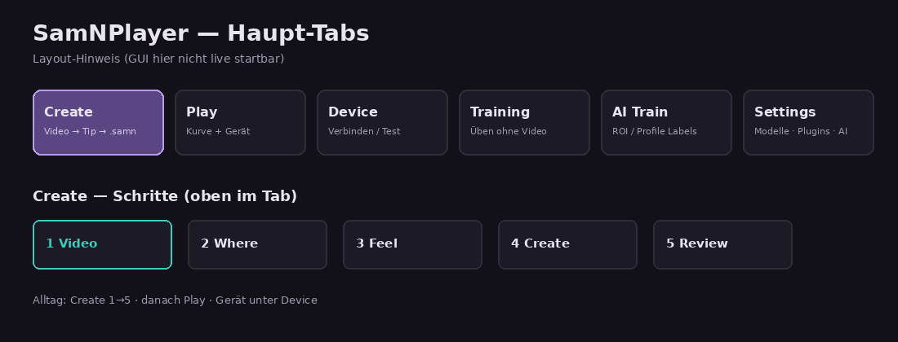
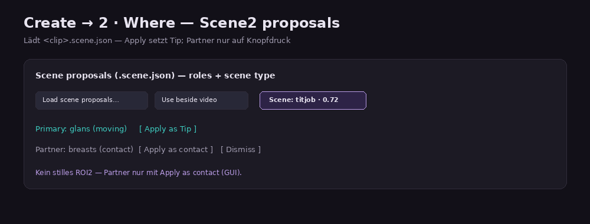
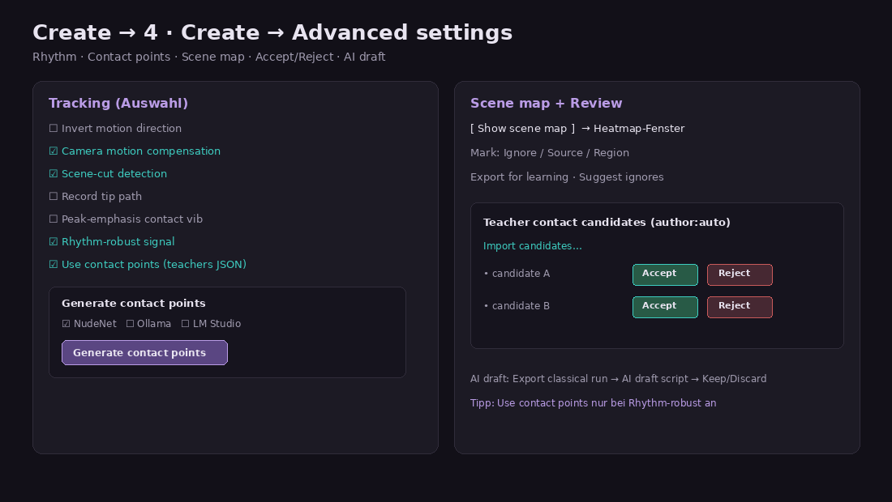
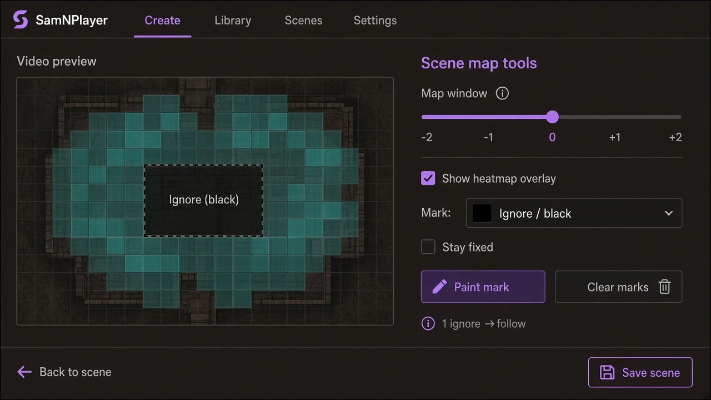
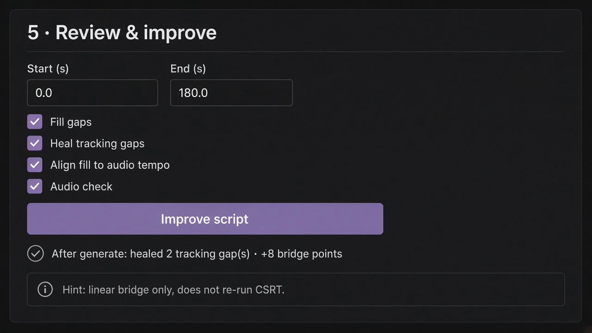
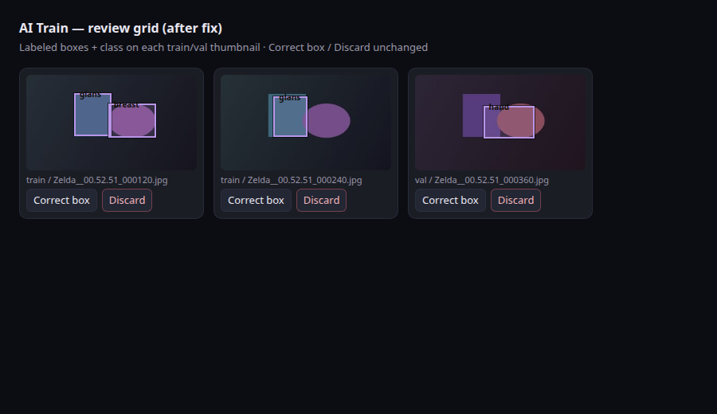
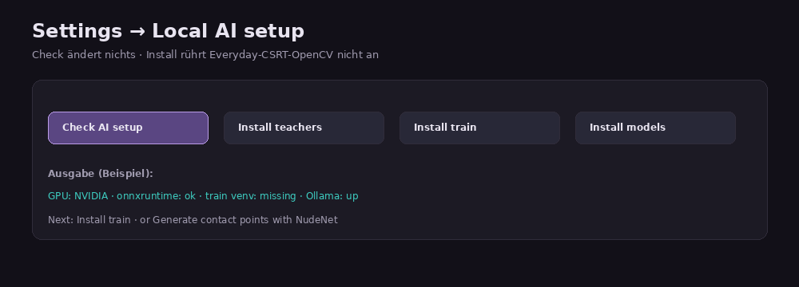

# SamNPlayer — Anleitung aller Funktionen

**Produkt:** SamNPlayer Emotion GUI · **Format:** `.samn` (Emotion Script) · Funscript nur Teilen/Import  
**Stand:** **v0.5.40** — Contact Verify ([#359](https://github.com/funfunpayer/SamNPlayer/pull/359)) · Bench Suggest ([#360](https://github.com/funfunpayer/SamNPlayer/pull/360))  
**Quellen:** `USER_HANDBOOK`, `LOCAL_MODEL_SETUP`, `AGENT_COORD`, GUI-Labels (Create / Play / Bench / Settings / AI Train)

GUI-Texte in der App sind Englisch. Diese Anleitung erklärt sie auf Deutsch.

**Bilder:** echte UI wo vorhanden; sonst Layout-Diagramme (GUI in dieser Umgebung nicht live startbar).

---

## Schnellstart (Alltag)

1. **Create** → Video wählen → Tip-Bereich finden → **Create Emotion Script**  
2. **Review** → ggf. Fill gaps / Heal tracking gaps  
3. **Play** → Kurve prüfen, Gerät verbinden  
4. Optional: Advanced (Rhythm, Contact points + **Verify**, Scene2) nur bei Drift / komplexen Clips  
5. Optional Qualität: Tab **Bench** → Kurzclip → **Suggest beside video** → Score / Label

**Regel (Owner):** Everyday-Erkennung = **Go-CSRT (nicht-KI)**. Hybrid-KI assistiert nur (Boxen/Style/Scene2/Verify vorschlagen oder filtern) — nie still die 0–100-Kurve. Markieren filtert Regionen; Repair/Improve poliert die Kurve klassisch (kein Re-Track).



```text
┌────────┬──────┬───────┬────────┬──────────┬──────────┬──────────┐
│ Create │ Play │ Bench │ Device │ Training │ AI Train │ Settings │
└────────┴──────┴───────┴────────┴──────────┴──────────┴──────────┘
 Create:  1 Video → 2 Where → 3 Feel → 4 Create → 5 Review
```

---

## 1. Create — Everyday (Video → Emotion Script)

### Zweck
Aus einem Video eine spielbare Emotion Script (`.samn` + Begleit-`.funscript`) erzeugen: Tip tracken → Stroke-Kurve → Contact-Vib.

### Wo in der GUI
Tab **Create** · Schritte 1–5 oben · Knopf **User handbook** öffnet die In-App-FAQ.

### So funktioniert’s

| Schritt | Was du tust |
|--------|-------------|
| **1 · Video** | **Choose video…** · optional **Check dependencies** |
| **2 · Where** | **Find tip area** (oder Box malen) · optional Contact-Marken (gold/magenta) |
| **3 · Feel** | Style: Normal / Soft / Autotune · **Contact vibration** (Standard an) |
| **4 · Create** | **Create Emotion Script** · Fortschritt im Log |
| **5 · Review** | Trim · Fill gaps · Heal tracking gaps · Audio check · Feedback |

Nach Generate läuft automatisch: Fill gaps + Heal bekannter Tracker-Verlust-Fenster (nur lineare Brücke).

### Tipps
- Tip-Box falsch → neu finden oder ziehen, nicht „mehr AI“.  
- Kurve fühlt sich invertiert an → Advanced → **Invert motion direction**.  
- Contact-Marken ändern heute die Stroke-Kurve nicht — sie speichern „wo Touch sich anfühlen soll“.

---

## 2. Tip finden · Smarter tip find · Show other spots

### Zweck
Startregion für CSRT setzen. AI darf nur die **Box vorschlagen**.

### Wo
Create → **2 · Where**

| Kontrolle | Bedeutung |
|-----------|-----------|
| **Find tip area** | Klassische Motion-Heuristik (oder AI, wenn Checkbox an) |
| **Show other spots** | Ranked Regionen · Klick = Tip · Shift-Klick = Contact (wenn Vib an) |
| **Smarter tip find** | ONNX-ROI aus Settings · braucht Modell + **Apply** |
| Time / Frame / +1s / +5s | Seek vor schwarzem Intro |
| **0–100 on video** | Stroke-Gauge über Preview (auch nach AI-Draft vor Keep) |

### Tipps
- Ohne ONNX bleibt klassisches Finden aktiv.  
- Nach AI-Vorschlag immer Box prüfen — nie blind übernehmen.

---

## 3. Contact vibration & Marken

### Zweck
Extra-Vib bei tiefen Strokes; optionale Contact-Flächen für späteres Feel (Stage A: Tip nahe Marke).

### Wo
- **An/Aus + Sensitivity/Curve:** Create → **3 · Feel**  
- **Marken:** Create → **2 · Where** (nur sichtbar wenn Contact vib an)  
- **Play:** **Show contact marks**

| Kontrolle | Bedeutung |
|-----------|-----------|
| Contact vibration | Standard **an** · Vib folgt Stroke-Tiefe |
| Sensitivity / Curve | Wann Vib greift · Soft onset = Default |
| Tip class / Contact type | Optional (z. B. Glans / Nipples) |
| Mark contact area | Gold = Haupt-Contact |
| + Another contact area | Magenta = weitere Marken |
| Fix contact area (static) | Gold-Box bleibt stehen (Kamera pannt) |
| + Ignore region (black) | Ausschluss (Knie/Hintergrund) — steuert nicht den Stroke |
| Record tip path (Advanced) | Speichert Tip-(x,y) für Feel Stage A |

### Tipps
- Feel Stage A: Tip-Pfad + Marken → Vib auch bei flachem Stroke, wenn Tip die Marke streift.  
- Soft-on von Record tip path mit Contact vib ist ok; du kannst es wieder ausmachen.

---

## 4. Scene2 proposals (Rollen + Szenentyp)

### Zweck
Aus Teachers × Motion: wer bewegt sich (Primary Tip), wer ist Contact-Partner, welcher Szenentyp — **nur Vorschlag**, Apply nötig.

### Wo
Create → **2 · Where** → Block **Scene proposals**



| Kontrolle | Bedeutung |
|-----------|-----------|
| **Load scene proposals…** | `<clip>.scene.json` wählen |
| **Use beside video** | Datei neben dem Video laden |
| Scene-type chip | z. B. `titjob · 0.72` für aktuelles Time-Seek |
| **Apply as Tip** | Primary → Tip-ROI (+ Region-Klasse) |
| **Apply as contact** | Partner → ROI2 — **nie automatisch** in der GUI |
| **Dismiss** | Overlay weg, Tip/ROI2 unverändert |

Companion entsteht typisch per CLI: `scene_roles.py` / `scan-scene-map` (siehe Engine-Docs). Soft-Load „beside video“ beim Öffnen, wenn Datei da ist.

### Tipps
- CLI `--scene-apply` füllt leere ROI/ROI2 opt-in; **GUI-Settings-Toggle „Apply AI setup automatically“** (Default aus) füllt leere Tip/Contact beim Soft-Load von `.scene.json` — Undo-Chip in Create.  
- Nie mit Tf/Tj-Distanzprofil still ROI2 setzen (würde Two-Point-Tracking auslösen).

---

## 5. Rhythm-robust signal

### Zweck
Auf langen Clips: Signal aus rhythmischen Flow-Zellen **nah am Tip**, damit CSRT-Drift nicht auf Oberschenkel/etc. umschwenkt.

### Wo
Create → **4 · Create** → **Advanced settings** → Checkbox **Rhythm-robust signal**

### So funktioniert’s
- Opt-in · nur Go-CSRT-Pfad · ca. +18 % Analysezeit  
- Aus = Everyday bit-identisch  
- Voraussetzung für **Use contact points**

### Tipps
- Erst bei sichtbarem Long-Clip-Drift einschalten.  
- Kein Everyday-Default (Owner-Gate).

---

## 6. Contact points · Generate · Use · Verify

### Zweck
Teachers (NudeNet / Ollama / LM Studio) liefern Kontakt-Anker-JSON. Rhythm-Grid darf nur suchen, wenn Tip-Box **> 3 Zellen** weg ist. Optional prüft die **Engine** (Hybrid-Verify) jeden Teacher-Punkt gegen das eigene Rhythm-Maß — schwache Anker fallen weg.

### Wo
Create → Advanced (sichtbar wenn **Rhythm-robust** an)



| Kontrolle | Bedeutung |
|-----------|-----------|
| **Use contact points** | Pfad zur Teachers-JSON aktiv |
| Pfad / **Choose…** | z. B. `clip.contact.json` |
| **Verify with the engine (hybrid, K=1.5)** | Opt-in **neben** Use: Engine behält einen Teacher-Punkt nur, wenn die eigene Rhythm-Zelle ≥ 1.5× stärker ist als die gewählte Zelle (wie CLI `--contact-verify 1.5`). Default **aus**; Zeile nur sichtbar wenn Use an |
| Teacher-Checkboxen | NudeNet · Ollama Qwen2.5-VL · LM Studio |
| **Generate contact points** | Schreibt `.contact.json`, füllt Pfad, aktiviert Use |

Leer/aus = Everyday Create **bit-identisch**. Verify ohne Use/Pfad = wirkungslos (K=0). Everyday-Create-Defaults unverändert.

### Owner-Kette (Contact Verify)

1. Advanced → **Rhythm-robust signal** an  
2. **Use contact points** + JSON (**Generate** oder **Choose…**)  
3. **Verify with the engine (hybrid, K=1.5)** an (optional)  
4. **Create Emotion Script** — schwache Teacher-Punkte steuern nicht mehr

### Tipps
- Teachers zuerst: Settings → **Check AI setup** / **Install teachers**.  
- Hybrid-Verify ist GUI-opt-in neben Use contact points — nie Everyday-Default (Owner erst nach mehreren Clips).  
- K ist fest **1.5** (gemessen); kein Schieberegler in der GUI.

---

## 7. Accept / Reject · Import candidates

### Zweck
Teacher-Kandidaten (`author:auto`) im Scene-Map reviewen. Nur **Accept** → `reviewed:true` → geeignet für P5c-YOLO-Export. Unreviewed bleiben draußen.

### Wo
Create → Advanced → nach **Show scene map** → Block **Teacher contact candidates**

| Kontrolle | Bedeutung |
|-----------|-----------|
| **Import candidates…** | Aus `.contact.json` → unreviewed Marks in Companion-`.samn` |
| **Accept** | Bestätigen (`reviewed:true`) |
| **Reject** | Marke löschen |

### Tipps
- Braucht vorhandene Scene-Map / Companion nach Create mit Rhythm.  
- Nicht verwechseln mit AI-Train **Correct box / Discard** (andere Review-Fläche).

---

## 8. Scene map (Heatmap & Marks)

### Zweck
Schnelle Rhythmus-Heatmap (~6×8s-Fenster) **ohne** Generate. Marks steuern, was erkannt/ignoriert wird.

**Ausführliche DE-Schritt (Schritt für Schritt):** [`generator-markieren.md`](generator-markieren.md)

### Wo
Create → Advanced → **Show scene map**



| Kontrolle | Bedeutung |
|-----------|-----------|
| Map window | Welches 8s-Fenster |
| Show heatmap overlay | Overlay an/aus |
| Mark: Ignore / Source / Region | Schwarze Ignore = nicht für Erkennung |
| Stay fixed | Box bleibt; aus = folgt Subject beim Create |
| Paint mark / Clear marks | Zeichnen / löschen |
| **Export for learning** | Nur wenn Settings → Collect learning data |
| **Suggest ignores from learning** | Priors aus ≥3 Exporten — nur Vorschlag |

### Tipps
- Nie auto vor Create.  
- Ignore = gleiches Job wie **+ Ignore region (black)** in Step 2.

---

## 9. AI draft script (experimentell)

### Zweck
Zweiter Pfad: aus exportierten klassischen Runs eine Imitations-Kurve strecken → Quality Doctor → Keep/Discard. Ersetzt CSRT **nicht**.

### Wo
Create → Advanced → Abschnitt **AI draft (experimental)**

| Kontrolle | Bedeutung |
|-----------|-----------|
| **Export classical run** | Nach gutem Create → Imitations-Sample |
| **AI draft script** | Ab ≥1 Sample; Draft auf 0–100-Gauge |
| **Keep draft** | Schreibt `.samn` (+ `.funscript`) |
| **Discard** | Draft weg, CSRT-Ergebnis bleibt |

### Tipps
- Grau = noch kein Export. ONNX-Vision-Writer ist **nicht** shipped.  
- Cloud-ChatGPT-Kurven sind out of product.

---

## 10. Advanced Tracking & Qualität (Kurzkarte)

Siehe vollständiges Inventar: [advanced-generator-audit.md](./advanced-generator-audit.md).

| Gruppe | Kontrollen |
|--------|------------|
| Tracking & polarity | Invert · Cam-comp · Scene-cut · Record tip path |
| Long-clip anti-drift | Rhythm-robust · Contact points / Generate |
| Scene map | Heatmap · Marks · Learning · Accept/Reject |
| AI draft | **Zugeklappt** · Export classical · Draft · Keep/Discard — nie Everyday-Default |
| Signal & quality | Sliding dynamics · Auto-Retry · O-markers |
| **Expert tuning** (zugeklappt) | Axis · Adaptive · Re-find (Python/soft-ignore) · Smooth/Peak/RDP/Max speed · CSRT-Hinweis · Impulse-Spiegel (= Feel → Curve) |

Power-user (Step 3): **Suggest profile** · **Remember scene + style** → später AI Train **Train Go profile model**.
Tracking-Method-Dropdown ist aus dem Blick (nur CSRT; DOM bleibt). 4-zone = CLI.

---

## 11. Review & improve (Step 5) — „Repair / füllen“

### Zweck
**Klassisch** das Go-CSRT-Ergebnis nachpolieren — **ohne** Tracker neu zu laufen und **ohne** KI.  
In der GUI: **Improve script** (Fill gaps · Heal tracking gaps). Läuft auch **automatisch einmal** direkt nach Generate.



| Kontrolle | Zweck |
|-----------|--------|
| Start/End (s) | Intro/Abspann trimmen |
| **Fill gaps** | Lineare Punkte über **lange Zeitlöcher** zwischen Actions (nicht „flache“ Segmente neu tracken) |
| **Heal tracking gaps** | Junk in `tracking_gaps` raus · nur diese Fenster linear überbrücken · Metadata clear (sonst Contact vib dauerhaft gedämpft) |
| Align fill to audio tempo | Abstand der Fill-Punkte nach Beat — Positionen bleiben linear |
| Audio check | Warnung Hz vs. Audio — schreibt Kurve nicht um |
| usable / borderline / unusable | Qualitäts-Feedback für Scoring |

### Tipps
- Heal ≠ Fill: Heal nur bekannte Verlustfenster aus Generate.  
- Beide Häkchen sind Default — nach Auto-Improve kann ein zweiter Klick „Nothing to change“ zeigen (Lücken schon geschlossen / Gaps schon gecleared).  
- Flache/falsche Kurve **ohne** Zeitloch → Tip neu finden / Invert / Create erneut — Fill erfindet keine Motion.  
- Audio „falsches Tempo“ → ROI/Achse prüfen, nicht Audio→Kurve erwarten.

---

## 12. Play

### Zweck
Emotion Script abspielen, Kurve editieren, Neo-2-Feel, Playlist, Projekte.

### Wo
Tab **Play**

| Bereich | Funktionen |
|---------|------------|
| Laden | Choose Emotion Script… · Playlist Add / Auto-advance / Shuffle / Repeat |
| Transport | Play / Stop / Extended-O · Progress · Vib/Suc live |
| Video | optional · Fullscreen · Make playable (ffmpeg) · 0–100 gauge · Contact marks |
| Kurve | Edit curve (dots): ziehen / klick = neu / Doppelklick = löschen (≥2) |
| Neo 2 | Optimize for Neo 2 · Bake feel · Strength · Recipe/Axes |
| Fein | Offset · Loop · Scale range ×0.8 · Speed-cap · Delete range · Heatmap PNG |
| Projekt | Save/Load `.snp.json` |
| Marken | Bookmarks · Chapters · O-markers |

**Tastatur:** Space · ←/→ · ,/. · 1–9 · +/− Offset · L Loop · E Extended-O · O Marker

### Tipps
- Importierte Funscripts → **Optimize for Neo 2** (Fill/Heal → Contact on → bake).  
- Ersetzt kein Tracking, das nie da war.

---

## 13. Bench — Suggest beside · Score · Labels

### Zweck
Everyday-Kandidat gegen FunGen-Referenz bewerten (**gut** / **prüfen** / **nicht gut**) und optional Labels für KI speichern. **Kein** Everyday-Create — nur Messen.

Ausführlich: [`benchmark-system.md`](benchmark-system.md) · Clip-Prep: [`benchmark-clip-prep.md`](benchmark-clip-prep.md)

### Wo
Tab **Bench**

### So funktioniert’s — Suggest beside video (v0.5.40)

Nach Clip-Prep (kurze Clips; FunGen-Ref + Everyday `__hub` neben dem Video):

| Schritt | Was du tust |
|--------|-------------|
| 1 | **Video** = Kurzclip wählen (Browse…) |
| 2 | **Suggest beside video** — füllt automatisch Referenz `stem.funscript` (FunGen) + Kandidat `stem__hub.funscript` (Everyday; auch Unterordner wie `mit_yolo/`) |
| 3 | **Score vs reference** → Anzeige **GUT** / **PRÜFEN** / **NICHT GUT** |
| 4 | Optional **Save label for KI** → JSONL neben der Benchmark-History |

Nur `stem.funscript` vorhanden (Everyday-Default-Pfad)? Dann wird das als **Kandidat** gefüllt — FunGen-Referenz weiter per Browse.

| Kontrolle | Bedeutung |
|-----------|-----------|
| Clip-Prep (scripts) | Hinweis + Copy-Command für `scripts/benchmark-prep/` — kein In-App-Cutter |
| **Suggest beside video** | Paar aus Ordner neben dem Clip vorschlagen (grau ohne Video) |
| Reference / Candidate | Manuell oder per Suggest |
| **Score vs reference** | Motion Fidelity + Quality Doctor |
| **Save label for KI** | Nach Score: Label-Zeile schreiben |
| Golden-clip manifest | Manifest → echte Everyday-Pipeline → History |

### Tipps
- Everyday bleibt Go CSRT; FunGen = Referenz; KI lernt aus Labels — ersetzt Everyday nicht.  
- Video ist für Suggest + Labels nötig; Score allein braucht nur Ref + Kandidat.

---

## 14. Device

### Zweck
Gerät verbinden und isoliert testen — ohne Playback.

### Wo
Tab **Device** (+ Topbar-Schnellstatus)

| Kontrolle | Bedeutung |
|-----------|-----------|
| Connect / Disconnect | Verbinden |
| Transport | BLE · Intiface Central · Mock |
| Vibration / Suction Sliders | Funktionstest |
| Short test pulse / All off | Kurzer Puls / Stop |
| Raw value test | Rohwerte |
| Run diagnostics | Latenz/Akzeptanz (nicht gefühlte Intensität) |

### Tipps
- Intiface: Central starten → Via Intiface (leer = dieser Rechner).  
- Nach einem Socket-Drop: **eine** Auto-Reconnect-Versuch; sonst erneut Connect.

---

## 15. Training

### Zweck
Üben ohne Video: Stop-Start, Plateau, Waves, Massage-Presets, eigene Scripts.

### Wo
Tab **Training**

Typische Bedienelemente: Preset wählen · Channel (Vibration/Suction/Both) · Cycles · Start/Stop · Arousal-Feedback · History/CSV.

### Tipps
- Unabhängig von Create/Play. Gerät sollte verbunden sein.

---

## 16. AI Train (ROI + Go-Profile)

### Zweck
Hilfsmodelle trainieren — **nicht** den Stroke-Writer.

### Wo
Tab **AI Train**

#### A) ROI / Tip-Boxen → ONNX
1. Video/Bild · Boxen malen (bis 9 Klassen) · **Use for training**  
2. **Review** — Thumbnails mit Box+Klasse · **Correct box** / **Discard**  
3. **Start training** → `roi_detector.onnx`  
4. Settings → Pfad / **Check availability** → Create **Smarter tip find**

#### B) Go profile model
Create → Remember scene + style → hier **Train Go profile model** → Create **Suggest profile** → Apply.

### Tipp nach v0.5.35 / #342 — Review-Boxen

Vor dem Fix waren YOLO-Boxen auf den Review-Thumbnails unsichtbar. Ab [#342](https://github.com/funfunpayer/SamNPlayer/pull/342) siehst du **beschriftete Boxen** auf jedem train/val-Thumbnail — so prüfst du Marken, bevor du trainierst.



### Tipps
- Schlechte Samples **Discard**, nicht „mehr Epochs“.  
- **Install AI train deps** nutzt separates Ökosystem; CSRT-OpenCV für Everyday bleibt getrennt (Settings Install train / teachers ebenso).

---

## 17. Settings — Modelle, Check AI, Plugins

### Zweck
Lizenz, Updates, lokale AI-Helfer, Plugins, Cache, Metriken.

### Wo
Tab **Settings** · auch **Open user handbook**



| Abschnitt | Was |
|-----------|-----|
| **AI region detection** | ONNX-Pfad · Preferred classes · Check availability · Open AI training |
| **Scene map learning** | Collect learning data (Default aus) · Delete learning data |
| **AI server** | Colibri/OpenAI-URL · **Test AI server** (`/v1/models`) |
| **Local AI setup** | **Check AI setup** · Install teachers / train / models |
| **Plugins** | Install pack… · Open Plugins folder · Refresh |
| Runtime / Updates / Cache / Hardware / License / Metrics | Betrieb |

**Check AI setup** ändert nichts — nur Diagnose (GPU, Packages, Train-Venv, Ollama/LM Studio/Colibri).

### Tipps
- Install-Profile rühren Everyday-CSRT-OpenCV nicht an.  
- AI-draft-Modellpfad gibt es in Settings noch nicht (Imitation über Export classical).

---

## 18. Plugins (Virtual Person cancelled)

### Zweck
Drop-Folder-Infra (H1): Packs mit `samn-plugin.json` installieren.

### Wo
Settings → **Plugins**

| Aktion | Effekt |
|--------|--------|
| Install pack… | Pack kopieren |
| Open Plugins folder | `%APPDATA%\SamNPlayer\plugins\` (Windows) öffnen |
| Refresh | Liste aktualisieren |

**Virtual Person** (Chat/Enable/Give/Overlay) ist **cancelled / out of scope** ([#264](https://github.com/funfunpayer/SamNPlayer/pull/264) geschlossen) — nicht geparkt. Produkt-UI in v0.5.35 geschrubbt (#341). Create/Play unverändert.

### Tipps
- Install bringt Pack-Infra — Create/Play bleiben Everyday.  
- Details: `docs/PLUGIN_INSTALL_DE.md`, `docs/PLUGIN_SYSTEM.md`.

---

## 19. Dateien auf der Platte

| Datei | Rolle |
|-------|--------|
| `*.samn` | Emotion Script (Wahrheit) |
| `*.funscript` | Community-Export/Import |
| `*.snp.json` | Playback-Projekt |
| `*.contact.json` | Teachers Contact points |
| `*.scene.json` | Scene2 proposals |
| `…/models/roi_detector.onnx` | Tip-ROI-Helfer |
| `…/models/motion_profile_model.json` | Style-Suggest |
| `…/roi_training_dataset/` | AI-Train-Daten |
| `…/scene_map_learning/` | Opt-in Learning-Export |
| `…/ai_script_imitation/` | Classical runs für AI draft |

---

## 20. Troubleshooting (kurz)

| Symptom | Versuch |
|---------|---------|
| Flache/hängende Kurve | Tip neu · Invert · Heal tracking gaps · tracking_gaps prüfen |
| Kamerapan-Drift | Camera compensation · Fix contact static aus |
| Long-Clip-Drift | Rhythm-robust · optional Contact points + **Verify with the engine** |
| Teacher-Punkte zu laut | Verify (K=1.5) an — oder Use aus für bit-identisch |
| Bench-Paar fehlt | Clip-Prep: `stem.funscript` + `stem__hub.funscript` neben Kurzclip · dann Suggest |
| AI draft grau | Einmal Export classical run |
| Smarter tip find fehlt | ONNX trainieren + Check availability |
| Review ohne Boxen | Build ≥ Fix #342 / v0.5.35+ |
| Contact vib „tot“ nach Gaps | Heal tracking gaps (cleared windows) |

---

## 21. Was absichtlich nicht Everyday ist

- Whole-frame 4-Zone / Flow als Generate-Default (CLI/Experiment)  
- ONNX-Vision-AI als Stroke-Writer (noch nicht shipped)  
- Cloud-LLM schreibt Positionen  
- In-App Clip-Prep-Cutter (Skripte + Bench-Panel reichen; Mark In/Out bleibt Owner-Prep)
- Contact-Verify / Rhythm als Everyday-Default (Owner-Gate ≥4–5 Clips)

---

## Verweise im Repo

- `docs/USER_HANDBOOK.md` — In-App-FAQ-Quelle  
- `docs/LOCAL_MODEL_SETUP.md` — lokale Helfer  
- `docs/EVERYDAY_GENERATE.md` — Everyday-Pfad  
- `docs/AI_SCRIPT_WRITER.md` — AI draft Stufen  
- `docs/SCENE_UNDERSTANDING_PLAN.md` — Scene2  
- `docs/owner/benchmark-system.md` — Bench / Suggest beside  
- `docs/PLUGIN_INSTALL_DE.md` — Plugins DE  
- `docs/AGENT_COORD.md` — Board / Rel40 Kontext  

**Medienordner:** [`media/anleitung/`](media/anleitung/)
