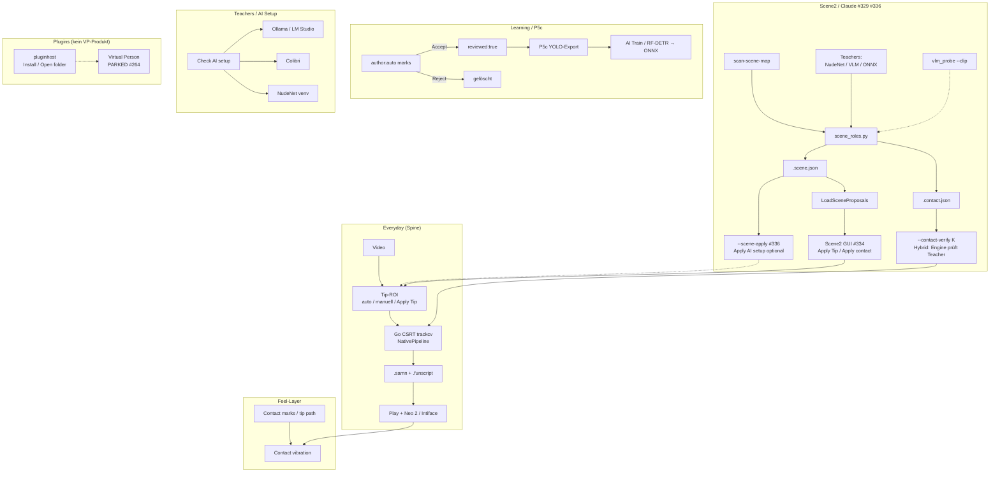

# Zusammenhang & Testen — SamNPlayer

**Für Owner** · Stand: **2026-09-28**  
Baseline: Rel35 **[`v0.5.35`](https://github.com/funfunpayer/SamNPlayer/releases/tag/v0.5.35)** · nächster Portable-Cut **v0.5.36** (wenn Patch [#343](https://github.com/funfunpayer/SamNPlayer/pull/343) / Review-Boxen [#342](https://github.com/funfunpayer/SamNPlayer/pull/342) drin sind)

Verwandt:

- Funktions-Anleitung: [`anleitung-funktionen.md`](anleitung-funktionen.md)
- Generator Markieren (Ignore / Scene map): [`generator-markieren.md`](generator-markieren.md)
- Release-Notizen (aktuell): [`v0.5.38-sammel.md`](v0.5.38-sammel.md) · Rel35 Tag: [v0.5.35](https://github.com/funfunpayer/SamNPlayer/releases/tag/v0.5.35)
- Lokale Modelle: [`../LOCAL_MODEL_SETUP.md`](../LOCAL_MODEL_SETUP.md), [`../COLIBRI_SETUP.md`](../COLIBRI_SETUP.md)
- Scene2-Plan: Repo `docs/SCENE_UNDERSTANDING_PLAN.md`
- Plugins: Repo `docs/PLUGIN_SYSTEM.md`

---

## 1. Ein Satz

**Everyday-Erkennung = Go-CSRT (nicht-KI): Tip-Box → Create → `.samn` → Play.**  
Hybrid-KI (Scene2, Teachers, YOLO-Review, Contact Points, AIWrite, Plugins) ist **opt-in Assist** — schlägt vor, misst mit, oder fühlt — schreibt die 0–100-Kurve nur nach bewusstem Keep/Apply. Markieren filtert Regionen am CSRT-Pfad; Repair/Improve ist klassisches Nachpolieren (Fill/Heal), kein KI-Re-Track. Siehe [`generator-markieren.md`](generator-markieren.md).

---

## 2. Architektur (Überblick)



**Nordstern:** Tip → Create → Play fühlt sich richtig an, ohne alles markieren zu müssen.  
AI schlägt vor · klassische Engine misst · du applyst.

---

## 3. Wie die Teile zusammenhängen

### 3.1 Everyday CSRT (Go)

| Was | Wo |
|-----|-----|
| Standard-Pfad | Create → Tip-Box → **Create** → `.samn` |
| Tracker | **Go CSRT** (`trackcv`), wenn Portable mit OpenCV gebaut ist (`-tags opencv`) |
| Rel35 Fix [#339](https://github.com/funfunpayer/SamNPlayer/pull/339) | „Re-find region after each cut“ (PerScene) erzwingt **nicht** mehr Python → kein MIL-Fallback auf Everyday |
| Log-Zeile erwartet | etwas wie **Go-native CSRT** / Go CSRT — **nicht** `CSRT not available … MIL` |

Python kommt nur noch, wenn du bewusst Python-only Advanced nutzt oder `PreferPython` / fehlendes Go-OpenCV.

### 3.2 Go vs Python

```text
GenerateWithContext
  ├─ NativeTrackingAvailable && NativePipelineEligible  →  Go CSRT (Everyday)
  └─ sonst                                              →  Python generate_funscript.py
```

| Pfad | Typische Fälle |
|------|----------------|
| **Go** | Everyday Tip-Create, Portable Windows/Linux mit OpenCV-DLLs |
| **Python** | AI-Training, Teachers (`contact_points`, `scene_roles`, `vlm_probe`), Forschungs-Backends (Flow/grid_lk CLI), PreferPython |

**Merke:** System-`opencv` 5 ohne contrib = MIL-Warnung — betrifft den **Python**-Pfad, nicht den Go-Portable-Everyday-Pfad nach #339.

### 3.3 Scene2 / Claude ([#329](https://github.com/funfunpayer/SamNPlayer/pull/329), [#336](https://github.com/funfunpayer/SamNPlayer/pull/336))

**#329 — Engine + CLI (Stage 2 + 2b + Hybrid):**

| Baustein | Rolle |
|----------|--------|
| `scan-scene-map` | Rhythm-Grid Motion-Scan → JSON |
| `scene_roles.py` | Körperteile × Motion → Rollen: primary / partner / ignore + Scene-Type |
| `.scene.json` | Proposals (ROICandidate-förmig) |
| `LoadSceneProposals` | Go-API für GUI/CLI |
| `vlm_probe --clip` | Video-Clip-Modus (N Frames / Span) — liest Scene-Type, Moving Part, Partner; ändert Rollen **noch nicht** bis Owner-Messung |
| `--contact-verify K` | Hybrid: Engine behält Teacher-Punkte nur, wenn lokale Rhythm-Zelle stark genug ist (empfohlen **1.5**). GUI: **Verify with the engine** neben Use contact points (Default aus) |

**#336 — Apply AI setup (opt-in):**

| Baustein | Rolle |
|----------|--------|
| `ApplySceneProposal` | Gemeinsame Regel CLI + GUI: leere ROI/ROI2/Klassen füllen |
| `--scene-apply` | Partner (ROI2) darf gesetzt werden — **default off** |
| Guard | User-Werte gewinnen; nie mit Tf/Tj-Distance-Profil (sonst schriebe AI indirekt die Kurve) |

**GUI [#334](https://github.com/funfunpayer/SamNPlayer/pull/334):** Load `.scene.json` → Scene-Type-Chip → **Apply Tip** / optional **Apply contact** (kein stilles ROI2 ohne Aktion). Settings-Toggle „Apply AI setup automatically“ = [#357](https://github.com/funfunpayer/SamNPlayer/pull/357) (Default aus + Undo).

### 3.4 Teachers / AI Setup

| Lehrer | Liefert | Setup |
|--------|---------|--------|
| **NudeNet** | Körperteil-Boxen / Contact | Settings → Check AI / Install teachers |
| **Ollama** (z. B. `qwen2.5vl:7b`) | VLM-Boxen + Clip-Lesen | `ollama pull …` · Check AI |
| **LM Studio / Colibri** | VLM bzw. Prosa (Profil/Qualität) | Server lokal · Settings AI-URL |
| **ONNX (eigen)** | Tip-ROI / später Contact-Detektor | AI Train → `.onnx` |

**Check AI setup** ändert nichts — nur Diagnose. Install-Profile rühren Everyday-OpenCV nicht an.

### 3.5 Contact Points

1. Advanced → **Rhythm-robust** an  
2. Lehrer anhaken → **Generate contact points** → `.contact.json`  
3. **Use contact points** → Rhythm-Grid sucht nur nahe Anchors, wenn Tip-Box >3 Zellen weg  
4. Optional: Rhythm + Use contact points + **Verify with the engine** (GUI) oder CLI `--contact-points F --contact-verify 1.5`

Leer/aus = Everyday bit-identisch.

### 3.6 Accept / Reject → P5c / YOLO

```text
Teacher / Import → author:auto, reviewed:false
       ↓
  Accept  → reviewed:true  → P5c YOLO-Export (#297 / Multi-Box #326)
  Reject  → Markierung weg
```

Unreviewed Autos gehen **nicht** ins Training.  
Nach [#342](https://github.com/funfunpayer/SamNPlayer/pull/342): Review-Karten zeigen **Box-Overlays** auf den Thumbnails (vorher fehlten Labels auf absoluten Pfaden).

### 3.7 Plugins — **kein VP-Produkt**

- Settings → Plugins → **Install pack…** / Open folder = generischer Host ([#275](https://github.com/funfunpayer/SamNPlayer/pull/275) + scrub [#341](https://github.com/funfunpayer/SamNPlayer/pull/341))
- **Virtual Person** Enable/Give/Titjob-UI: **entfernt / geparkt** ([#264](https://github.com/funfunpayer/SamNPlayer/pull/264))
- Erwartete Meldung bei altem Code-Pfad: Host not running — ignorieren, außer du testest absichtlich #264

---

## 4. Owner-Test-Checkliste

Zielbuild: **portable v0.5.35** jetzt; **v0.5.36**, sobald Patch/Review-Boxen im Release sind. Frischer Ordner, kein alter Sticky-State.

### A. Startup / Packaging

| # | Test | Erwartung |
|---|------|-----------|
| A1 | Version in About/Log | `0.5.35` (bzw. `0.5.36`) |
| A2 | ffmpeg neben exe | Startup ohne Tool-Fehler |
| A3 | Settings / UI | **kein** Virtual-Person Enable/Give/Titjob-Produkt |
| A4 | Plugins | Install pack / Open folder sichtbar |

### B. Everyday CSRT (#339)

| # | Test | Erwartung |
|---|------|-----------|
| B1 | Tip-ROI → Create (Advanced PerScene egal) | Log **Go CSRT**, nicht Python MIL |
| B2 | `.samn` → Play | Seek, Heatmap, Playhead OK |
| B3 | Contact vib an (ohne Impulse-Bug) | Zweite Spur / Feel; Gerät optional |

### C. Impulse / Advanced (#337)

| # | Test | Erwartung |
|---|------|-----------|
| C1 | Peak-emphasis / impulse anhaken → Create | **kein** `exit status 2` / invalid choice `impulse` |

### D. Scene2 GUI + Claude-Features (#329 / #334 / #336)

| # | Test | Erwartung |
|---|------|-----------|
| D1 | `.scene.json` laden (Load / companion) | Scene-Type-Chip sichtbar |
| D2 | **Apply Tip** | Primary wird Tip-ROI; Klasse wenn kanonisch |
| D3 | **Apply contact** (explizit) | Partner nur nach Klick — kein stilles ROI2 |
| D4 | CLI ohne `--scene-apply` | Primary optional; Partner nur geloggt |
| D5 | CLI `--scene-proposals F --scene-apply` | Leere ROI2/Klassen gesetzt; Logzeilen; User-Werte bleiben |

Beispiel-Kette (Owner-PC):

```bash
SamNPlayer-cli scan-scene-map clip.mp4 --windows 64 --out clip.scan.json
python generator/scene_roles.py --video clip.mp4 --scan clip.scan.json --nudenet \
  --out clip.scene.json --contact-out clip.scene.contact.json
SamNPlayer-cli generate --video clip.mp4 --roi x,y,w,h --rhythm-grid \
  --contact-points clip.scene.contact.json --contact-verify 1.5
```

### E. VLM Clip (Claude Stage 2b — Owner-GPU)

| # | Test | Erwartung |
|---|------|-----------|
| E1 | `ollama pull qwen2.5vl:7b` (oder gewähltes VL) | Modell lokal |
| E2 | Probe | siehe Befehl unten → `*.vlm.json` |
| E3 | Optional: `scene_roles.py --vlm … --truth …` | `summary.vlm` / Agreement — **ändert Rollen noch nicht** |

```bash
python generator/vlm_probe.py --video clip.mp4 --model qwen2.5vl:7b --clip 6 --every-s 20
```

### F. Teachers / Ollama / Colibri

| # | Test | Erwartung |
|---|------|-----------|
| F1 | Settings → **Check AI setup** | GPU/Pakete/Server-Status; keine Installation |
| F2 | Install teachers (optional) | NudeNet o. ä. ohne CSRT-OpenCV-Bruch |
| F3 | Ollama läuft → Generate contact points | `.contact.json` gefüllt |
| F4 | `coli serve` → Settings AI-URL → **Test AI server** | `/v1/models` grün; Suggest/Qualität optional |

### G. Contact Points + Hybrid Verify

| # | Test | Erwartung |
|---|------|-----------|
| G1 | Rhythm-robust + Use contact points | Create läuft; Anchors greifen nur bei Distanz |
| G2 | `--contact-verify 1.5` | Punkte werden gefiltert; Kurve nicht schlechter als Baseline auf bekannten Clips |
| G3 | Ohne Points / aus | Bit-identisch Everyday |

### H. Accept / Reject + Review-Boxen (#328 / #342)

| # | Test | Erwartung |
|---|------|-----------|
| H1 | Import candidates / `author:auto` | Pending-Liste in Scene Map |
| H2 | **Accept** | `reviewed:true` → P5c-fähig |
| H3 | **Reject** | Markierung weg |
| H4 | AI Train Review-Grid (**nach #342 / v0.5.36**) | **Boxen + Klassen** auf Thumbnails sichtbar |

### I. Play / Device / Regression

| # | Test | Erwartung |
|---|------|-----------|
| I1 | Seek, Heatmap, Offset | Sync bleibt |
| I2 | Neo 2 oder Intiface (falls da) | Vibration/Suction folgen |
| I3 | Alter `v0.5.34`-Portable parallel | Startet noch in sauberem Ordner |

---

## 5. Was bewusst *nicht* getestet werden muss

| Thema | Status |
|-------|--------|
| Virtual Person Produkt-UI | Geparkt (#264 / #341 scrub) |
| Rhythm-Grid Everyday-Default | Owner + Claude-Messung ≥4–5 Clips zuerst |
| SceneMap P5-Audit [#290](https://github.com/funfunpayer/SamNPlayer/issues/290) | Backlog, kein Rel35-Blocker |
| AIWrite ONNX-Writer | Scaffold — Imitation-Keep reicht |
| Settings „Apply AI auto“ Toggle | CLI da (#336); GUI-Toggle optional nach Rel35-Smoke |

---

## 6. Schnell-Zuordnung PR → Feature

| PR | Was | Owner sieht |
|----|-----|-------------|
| [#329](https://github.com/funfunpayer/SamNPlayer/pull/329) | Scene2 Engine: roles, VLM clip, contact-verify | CLI + Dateien `.scene.json` / verify |
| [#334](https://github.com/funfunpayer/SamNPlayer/pull/334) | Scene2 GUI LoadSceneProposals | Apply Tip / Apply contact |
| [#336](https://github.com/funfunpayer/SamNPlayer/pull/336) | Apply AI setup opt-in | `--scene-apply` |
| [#328](https://github.com/funfunpayer/SamNPlayer/pull/328) | AutoReview + Check AI + contact points GUI | Accept/Reject, Check AI, Generate points |
| [#326](https://github.com/funfunpayer/SamNPlayer/pull/326) / [#297](https://github.com/funfunpayer/SamNPlayer/pull/297) | P5c YOLO (Multi-Box) | Export nur reviewed |
| [#339](https://github.com/funfunpayer/SamNPlayer/pull/339) | Go CSRT force | Everyday ohne MIL |
| [#337](https://github.com/funfunpayer/SamNPlayer/pull/337) | Impulse argparse | Peak-emphasis Create |
| [#341](https://github.com/funfunpayer/SamNPlayer/pull/341) | VP scrub | Kein VP-Produkt |
| [#342](https://github.com/funfunpayer/SamNPlayer/pull/342) | Review-Box-Overlays | Boxen im AI-Train-Review |
| [#340](https://github.com/funfunpayer/SamNPlayer/pull/340) | Rel35 tag | `v0.5.35` Release |

---

## 7. One-liner zum Merken

**Go-CSRT schreibt. Teachers zeigen. Scene2 schlägt Tip/Partner vor. Contact-verify prüft. Accept öffnet YOLO. Plugins hosten ohne VP. Du testest Portable → Everyday → Scene2 Apply → Teachers → Review-Boxen.**
